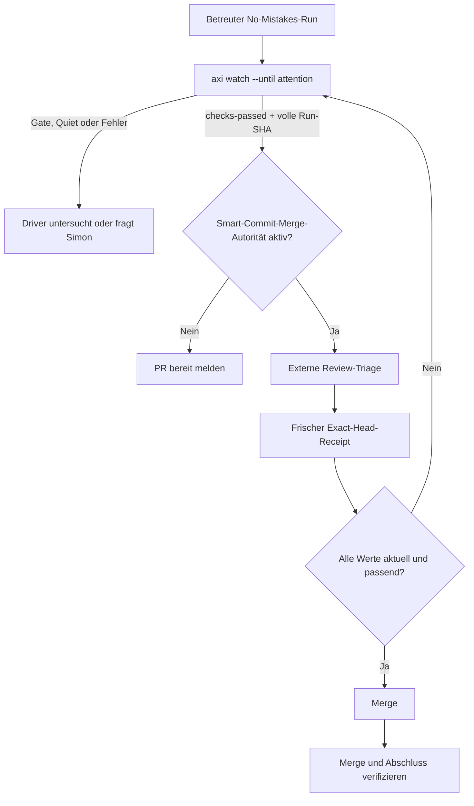

# Codex Driver Checks-Passed Handoff - Plan

## Goal Capsule

Ein über Smart Commit gestarteter und dafür autorisierter Codex-Driver soll einen erfolgreichen No-Mistakes-PR nach `checks-passed` ohne unnötiges Warten weiterführen: externe Reviews prüfen, den aktuellen Stand noch einmal verifizieren und dann mergen.
Ohne diese vorab erteilte Autorität endet derselbe Übergabepunkt klar als „PR bereit“ und verlangt eine menschliche Entscheidung.
Der fortlaufende CI-Monitor bleibt dafür unverändert im Hintergrund.

---

## Product Contract

### Summary

No-Mistakes besitzt bereits den passenden Agenten-Handoff `checks-passed`.
Gebaut wird keine zweite Statusmaschine, sondern ein einheitlicher Codex-Driver-Vertrag, der diesen Handoff eindeutig auswertet.
Ein schlankes Vordergrund-`axi watch` darf den aktiven Turn bis zum nächsten relevanten Ereignis halten.
Ein Hook-basierter Reentry-Supervisor gehört nicht zu diesem Versand.

### Problem Frame

Heute widersprechen sich zwei Anweisungen: Der generierte No-Mistakes-Skill behandelt `checks-passed` als Übergabe an einen Menschen; der lokale Smart-Commit-/No-Mistakes-Flow erlaubt unter engen Bedingungen bereits den automatischen Merge.
Dadurch kann Codex nach erfolgreicher CI eine finale Statusantwort senden, obwohl der freigegebene Driver-Pfad noch offen ist.
Der laufende Hintergrundmonitor verstärkt die Verwirrung, weil er technisch weiter aktiv bleibt, obwohl der Driver seine Arbeit fortsetzen kann.

### Product Intent

Der primäre Nutzer ist Simon als autorisierender Entwickler.
Er startet einen Smart-Commit-Autopiloten und erwartet, dass Codex den vorhandenen No-Mistakes-Lauf betreut, echte Entscheidungen vorlegt und einen bereits freigegebenen, exakt geprüften PR selbstständig zu Ende bringt.

### User Story

Als Simon möchte ich nach einer in Smart Commit erteilten Merge-Freigabe nicht
noch einmal nach dem CI-Handoff „GO“ sagen müssen, damit ein wirklich grüner,
unveränderter PR sicher gemergt wird.

### Primary Journey

1. Smart Commit startet einen betreuten No-Mistakes-Run und hält den Codex-Turn über `axi watch` bis zum nächsten relevanten Ereignis aktiv.
2. Bei Gate, Quiet oder Fehler hält der Driver an, prüft die Ursache und entscheidet innerhalb seiner Autorität oder fragt Simon.
3. Bei `checks-passed` triagiert der Driver externe PR-Reviews.
4. Ohne vorab erteilte Merge-Autorität meldet er den PR als bereit und fordert eine Entscheidung an.
5. Mit vorab erteilter Merge-Autorität erzeugt er einen frischen Exact-Head-Receipt.
6. Nur bei passender Branch, PR, voller Head-SHA, fehlenden offenen Gates, grüner Mergeability und klarer externer Review-Triage führt er den Merge aus.
7. Nach dem Merge verifiziert der Driver den PR-Zustand und übergibt die lokale Aufräum- und Abschlussarbeit an den bestehenden Smart-Commit-Flow.

### Operator Journey

Die menschliche TUI und der bestehende CI-Monitor behalten ihr heutiges Verhalten: Sie dürfen eine offene PR bis Merge oder Close beobachten.
Der neue Driver-Pfad ändert nur die Bedeutung des erfolgreichen AXI-Handoffs für eine aktive, autorisierte Codex-Session.

### Requirements

- R1. `checks-passed` bleibt der einzige kanonische Agenten-Handoff für „genau dieser offene PR ist auf seinem aktuellen Stand CI-bereit“.
- R2. Es gibt keinen neuen persistenten `merge_ready`-Status, kein Alias und keine Änderung der TUI- oder CI-Monitor-Lebensdauer.
- R3. Der offizielle No-Mistakes-Agentenvertrag und der lokale Smart-Commit-Vertrag müssen eine explizite Prioritätsregel haben: Ein vorab autorisierter Driver folgt dem Receipt-/Review-/Merge-Pfad; sonst fordert er nach `checks-passed` menschliche Merge-Freigabe an.
- R4. Ein Codex-supervised Run darf bei laufendem Turn nicht nach `checks-passed` mit einer finalen Statusmeldung enden, wenn die nötige Smart-Commit-Merge-Autorität bereits vorliegt.
- R5. `axi watch --until attention` hält den Vordergrund-Driver bis zu Gate, Quiet, terminalem Ergebnis oder `checks-passed` und gibt nur im letzten Fall einen eindeutigen kanonischen Handoff aus.
- R6. AXI muss die volle gespeicherte Run-Head-SHA maschinenlesbar ausgeben; die bisherige Kurzform darf nicht als Exact-Head-Receipt gelten.
- R7. Vor jedem automatischen Merge muss der Driver einen frischen, menschenlesbaren Exact-Head-Receipt prüfen: aktuelle PR, Branch, volle Head-SHA, Mergeability, No-Mistakes-Outcome, keine offenen Gates und externe Review-Triage.
- R8. Hat sich die PR-Head-SHA nach `checks-passed` geändert, darf der Driver nicht auf Basis des alten Receipts mergen. Er kehrt in den bestehenden Reconcile-/Handoff-Pfad zurück.
- R9. Grüne CI allein erteilt niemals Merge-Autorität.
- R10. Der Hook-/Session-Reentry-Supervisor bleibt opt-in und außerhalb dieses ersten Upstream-Versands.

### Actors

- A1: Simon — erteilt oder verweigert die Merge-Autorität im Smart-Commit-Run.
- A2: Codex-Driver — betreut den Run, triagiert, erzeugt den Receipt und führt
  nur autorisierte Schritte aus.
- A3: No-Mistakes — liefert `checks-passed`, bewahrt den Hintergrundmonitor
  und stellt den Vordergrund-Watch bereit.
- A4: GitHub — liefert den autoritativen aktuellen PR-Head, Mergeability,
  Checks und externe Review-Signale.

### Key Flows

- F1: Autorisierter erfolgreicher Handoff — `checks-passed` → externe
  Review-Triage → frischer Exact-Head-Receipt → Merge → Abschluss.
- F2: Nicht autorisierter erfolgreicher Handoff — `checks-passed` → „PR
  bereit“ → Simon entscheidet → erst dann erneute frische Prüfung und Merge.
- F3: Unsicherer Handoff — Gate, Quiet, Fehler, unklare Mergeability oder
  Head-Wechsel → kein Merge → bestehender Antwort-, Diagnose- oder
  Reconcile-Pfad.
- F4: Geschlossene Session — Watch meldet ein Ereignis nur innerhalb des
  aktiven Turns; ohne separat installierten Reentry-Adapter wird keine
  autonome Wiederaufnahme behauptet.

### Acceptance Examples

- AE1: Ein Gate während des Watchs führt zu keinem Merge und zu einer klaren
  Entscheidung oder einer autorisierten technischen Behebung.
- AE2: `checks-passed` ohne Smart-Commit-Merge-Autorität meldet einen
  merge-bereiten PR, führt aber keinen `gh pr merge` aus.
- AE3: `checks-passed` mit Smart-Commit-Merge-Autorität und passendem
  Exact-Head-Receipt führt nach klarer externer Review-Triage zum Merge.
- AE4: Nach `checks-passed` ändert ein Rebase oder Push die Head-SHA. Der
  Driver stoppt vor dem Merge und wartet auf einen neuen gültigen Handoff oder
  führt den vorhandenen Reconcile-Pfad aus.
- AE5: Ein terminaler Erfolg, Fehlschlag oder Abbruch beendet den Watch und
  wird als solcher berichtet.
- AE6: Ein Quiet-Signal oder fehlende Mergeability ist ein Aufmerksamkeits-
  Ereignis, niemals eine implizite Merge-Freigabe.
- AE7: Trifft zwischen erster Review-Triage und finalem Receipt ein neues oder
  unklar klassifiziertes externes Review ein, führt der Driver keinen Merge aus
  und kehrt zu Watch oder Reconcile zurück.

### Confirmed Decisions

- D1: `checks-passed` bleibt kanonisch; kein `merge_ready`.
- D2: Die Autorität stammt ausschließlich aus Smart Commit, nie aus grüner CI.
- D3: Ein frischer Exact-Head-Receipt ist unmittelbar vor dem Merge Pflicht.
- D4: Der erste Upstream-Schnitt umfasst `axi watch` und den
  Codex-/Smart-Commit-Handoff, nicht den Hook-Supervisor.

### Scope Boundaries

Nicht Teil dieses Vorhabens sind eine neue persistente Run-State-Maschine,
Änderungen am menschlichen TUI-Monitor, ein automatisch installierter Codex-
Hook, ein Wiederaufnahme-Daemon für beendete Sessions oder ein Merge ohne
vorherige Autorisierung.

### Dependencies / Assumptions

- Der Driver kann GitHub CLI und die erforderlichen GitHub-Rechte nutzen; ein
  konkreter Auth-, Branch-Protection- oder Merge-Fehler bleibt ein echter
  Blocker.
- `checks-passed` ist nur vertrauenswürdig, wenn die CI-Provenienz fail-closed
  arbeitet. Die aktuelle lokale Quelle schützt ein unbekanntes
  Workflow-Ruleset mit einem synthetischen Pending-Check statt eines falschen
  „keine Checks = grün“-Signals.
- Der permanente Hintergrundmonitor darf nach dem Handoff weiterlaufen; der
  Driver muss daher immer die aktuelle PR-Head-SHA prüfen.

### Elons Principles Guard

- Geprüft: autonomer Abschluss eines bereits genehmigten Merges.
- Gelöscht: zusätzlicher Status und verpflichtender Supervisor.
- Vereinfacht: ein Handoff, ein Receipt, ein vorhandener Merge-Pfad.
- Automatisiert: nur nach expliziter Autorisierung und frischer Prüfung.

### Open Questions

Keine produktseitigen Blocker. Die konkrete Formulierung der Prioritätsregel
und die kleinstmögliche Watch-CLI-Oberfläche sind Planungs- und
Implementierungsfragen.

### Sources / Research

- `internal/cli/axi_drive.go` — `checks-passed` als erfolgreicher,
  nichtterminaler CI-Handoff.
- `internal/cimonitor/cimonitor.go` — fortlaufendes Monitor-Verhalten für
  offene PRs.
- `skills/no-mistakes/SKILL.md` — generischer agentischer Handoff.
- `internal/cli/axi_watch.go` auf `origin/feat/axi-watch` — vorhandener
  Vordergrund-Watch-Entwurf.
- `docs/plans/2026-07-15-001-feat-axi-event-watcher-plan.md` auf
  `origin/feat/axi-watch` — Trennung von Watch und Supervisor.
- Lokale Codex-Skills außerhalb dieses Repos — bestehender
  Smart-Commit-Autopilot, Receipt-Vertrag und autorisierte
  Merge-Fortsetzung.
- `internal/scm/github/github.go` und `internal/scm/github/github_test.go` —
  fail-closed Schutz für unbekannte GitHub-Required-Check-Policies.

---

## Planning Contract

### Product Contract preservation

Product Contract changed: R5-R8 wurden nach lokaler Forschung präzisiert, damit der Watch-Handoff maschinenlesbar ist und ein Exact-Head-Receipt tatsächlich die No-Mistakes-Run-SHA belegen kann.

### Key Technical Decisions

- KTD1. Den bestehenden Handoff erweitern statt einen Run-Status einzuführen. `checks-passed` bleibt das einzige erfolgreiche, nichtterminale Ergebnis für eine offene PR. Der Watch spiegelt dieses Ergebnis als top-level Outcome; das ändert keine Persistenz und keine TUI-Semantik.
- KTD2. Den Watch-Entwurf selektiv portieren. Nur der lesende, ereignisgesteuerte Watch-Schnitt wird aus `origin/feat/axi-watch` übernommen. Supervisor, Codex-Hook, Persistenz, Worker und Spawn-Code werden nicht cherry-gepickt.
- KTD3. Den vollen Commit-Hash als separaten AXI-Wert ausgeben. Der bestehende kurze `run.head` bleibt eine Anzeigehilfe. Ein zusätzlicher voller Wert bindet Run, lokalen Head und GitHub-PR-Head für den Receipt zusammen.
- KTD4. Merge-Autorität bleibt außerhalb von No-Mistakes. Der öffentliche Skill beschreibt die sichere Verzweigung; nur ein aktiver Smart-Commit-Driver mit vorheriger Autorisierung darf die autorisierte Seite wählen. Diese Autorisierung ist an Run-ID, Branch, PR, volle Head-SHA, Merge-Methode und aktuelle Session gebunden.
- KTD5. Der Receipt wird zweimal geprüft. Nach Watch-Rückkehr und unmittelbar vor dem Merge müssen Run-ID, Branch, PR, volle Head-SHA, fehlende Gates, GitHub-Mergeability und externe Review-Triage übereinstimmen. Jede Abweichung führt zurück zu Watch oder Reconcile.

### High-Level Technical Design

### Assumptions

- Der lokale Smart-Commit-Driver bleibt die Stelle, die eine vorhandene Merge-Autorität bewertet und den GitHub-Merge ausführt.
- Die neue AXI-Ausgabe ergänzt den bestehenden Kurz-Hash rückwärtskompatibel, statt ihn umzubenennen oder zu entfernen.
- Der Watch-PR wird gegen den aktuellen `local/codex-personal-build`-Stand neu geschnitten, nicht als ganzer historischer Branch übernommen.

### System-Wide Impact

Die öffentliche No-Mistakes-CLI gewinnt einen lesenden Watch- und Handoff-Vertrag, ohne die Pipeline oder den Daemon umzubauen.
Die persönliche Codex-Installation erhält danach eine kompatible Driver-Regel und muss die neue No-Mistakes-Binary bewusst installieren; ein reguläres Upstream-Update darf diese lokale Integration nicht still überschreiben.

### Risks and dependencies

| Risiko oder Abhängigkeit | Umgang im Plan |
|---|---|
| Der Watch-Branch enthält Supervisor-Code | Selektive Übernahme und Diff-Audit gegen die explizite Ausschlussliste. |
| Ein Watch-Snapshot wird nach Rebase oder Push alt | Voller SHA-Receipt zweimal prüfen; bei Drift keinen Merge ausführen. |
| Externe Kommentare erscheinen nach der ersten Triage | Triage unmittelbar vor Merge erneut prüfen; neue oder unklare Kommentare blockieren. |
| GitHub meldet Mergeability noch nicht | Als unklar behandeln und weiter beobachten, niemals optimistisch mergen. |
| Eine beendete Codex-Session kann nicht automatisch aufwachen | Als bewusste Grenze berichten; Hook-/Reentry-Supervisor bleibt separat. |

### Elons Principles Guard

- Requirement check: Der Nutzer braucht einen betreuten, autorisierten Abschluss, keinen neuen Pipeline-Zustand.
- Deleted or avoided: Persistenter `merge_ready`, Supervisor, Hook-Installation und jede Änderung am menschlichen Monitor.
- Simplified before speed/automation: Ein Watch, ein bestehender Handoff und ein Receipt ersetzen eine zweite Orchestrierungsschicht.
- Automation stance: Geplant nur für einen aktiven, autorisierten Driver; Stopp bei Gate, Head-Drift, unklarer Mergeability oder neuer Review.

---

## Implementation Units

### U1. Schlanken AXI-Watch und eindeutigen Handoff einführen

- **Goal:** Einen lesenden `axi watch`-Befehl bereitstellen, der einen bekannten Run effizient bis zu Gate, Quiet, `checks-passed` oder Terminalzustand beobachtet.
- **Requirements:** R1, R2, R5, R10; F1, F3, F4; AE1, AE5, AE6.
- **Dependencies:** None.
- **Files:** `internal/cli/axi.go`, `internal/cli/axi_watch.go`, `internal/cli/axi_render.go`, `internal/cli/axi_watch_test.go`, `internal/cli/axi_test.go`, `internal/ipc/client.go`, `internal/ipc/subscribe_test.go`.
- **Approach:** Den vorhandenen Watch-Entwurf als Vorlage nutzen: explizite Run-ID, frischer Read vor jeder Entscheidung und IPC-Subscription als Wecker. Dafür ausschließlich die kleine IPC-Abhängigkeit `SubscribeContext` übernehmen: Sie muss einen wartenden Subscribe-Handshake und einen offenen Stream bei Kontextende sauber schließen. Nur den Watch registrieren. Gate, Quiet und Terminal bleiben unterscheidbare Stopgründe. Bei CI-Bereitschaft ergänzt der Watch sein `stop: checks-passed` um den kanonischen top-level `outcome: checks-passed`; andere Stopgründe erhalten diesen Outcome nie.
- **Execution note:** Erst den Output-Contract mit kleinen Render- und Zustands-Tests festlegen; erst danach die Subscription-Schleife einfügen.
- **Patterns to follow:** `internal/cli/axi_drive.go` für den bestehenden `checks-passed`-Outcome, `internal/cimonitor/cimonitor.go` für das Ready-Signal und `internal/cli/axi_render.go` für TOON-Objekte.
- **Test scenarios:**
  - Covers AE1. Ein geparkter Gate-Run beendet `--until attention` mit Gate-Informationen und ohne Merge-Outcome (`unit_mocked`; beweist die AXI-Output-Verzweigung, nicht die Pipeline-Antwort).
  - Covers AE5. Ein abgeschlossener, fehlgeschlagener oder abgebrochener Run beendet Watch terminal und bewahrt Fehler-Informationen (`unit_mocked`; beweist die CLI-Darstellung, nicht eine reale Daemon-Laufzeit).
  - Covers AE6. Ein Quiet-Signal beendet `--until attention`, aber ein `--until terminal` bleibt dabei offen (`integration_local`; beweist die lokale Watch-Entscheidung, nicht Session-Reentry).
  - Ein CI-bereiter Run liefert `watch.stop: checks-passed` und ausschließlich dort `outcome: checks-passed` (`integration_local`; beweist den Driver-Handoff, nicht Merge-Autorität).
  - Fehlende Run-ID, unbekannter `--until`-Wert, gestoppter Daemon und geschlossener IPC-Stream liefern strukturierte Fehler oder definierte Interrupt-Ergebnisse (`integration_local`; beweist lokale Fehlergrenzen).
  - Ein abgebrochener Kontext beendet sowohl einen wartenden Subscribe-Handshake als auch einen offenen Event-Stream zeitnah und ohne den Pipeline-Run zu verändern (`integration_local`; beweist die Interrupt- und Cleanup-Grenze für SIGINT/SIGTERM, nicht Session-Reentry).
- **Verification:** Der Befehl startet keinen Daemon, mutiert keinen Run und hat keinen Import oder Registrierungsweg zum Supervisor-/Hook-Code.

### U2. Exact-Head-Receipt auf eine volle Run-SHA stützen

- **Goal:** Den AXI-Output so ergänzen, dass ein Driver die gespeicherte volle Run-SHA mit GitHub und lokalem Git eindeutig abgleichen kann.
- **Requirements:** R6, R7, R8, R9; F1, F3; AE3, AE4, AE6.
- **Dependencies:** U1.
- **Files:** `internal/cli/axi_render.go`, `internal/cli/axi_test.go`, `internal/cli/axi_watch_test.go`, `internal/cli/axi_drive_test.go`.
- **Approach:** Den bestehenden lesefreundlichen Kurz-Hash `run.head` beibehalten und einen separaten maschinenlesbaren Voll-Hash ergänzen. Dieser Wert muss in `axi run`, `axi status` und Watch-Rückgaben aus demselben `runView.HeadSHA` stammen. Der Watch selbst ist kein Merge-Befehl und ersetzt keine GitHub-Abfrage.
- **Patterns to follow:** `internal/ipc/protocol.go` hält `RunInfo.HeadSHA` bereits als volle SHA; `internal/cli/axi_render.go` besitzt die zentrale Run-Render-Funktion.
- **Test scenarios:**
  - `axi run`, `axi status` und jede Watch-Rückgabe zeigen bei einem 40-stelligen Run-Hash weiterhin den kurzen Anzeige-Hash und zusätzlich denselben vollen maschinenlesbaren `head_sha` (`unit_mocked`; beweist die Datenbindung in jeder Receipt-Oberfläche).
  - Ein verkürzter Hash allein erfüllt keinen Receipt-Test (`unit_mocked`; beweist die Guard-Regel, nicht GitHub-Mergeability).
  - Covers AE4. Ein nach `checks-passed` geänderter voller GitHub- oder lokaler Head invalidiert den Receipt und führt nicht zu einem Merge-Versuch (`integration_local`; beweist die lokale Guard-Verzweigung).
- **Verification:** Die neue Ausgabe ist additiv und alle AXI-Oberflächen mit `run`-Objekt bleiben rückwärtskompatibel lesbar.

### U3. Öffentliche Agenten-Guidance auf autorisierten Driver-Handoff ausrichten

- **Goal:** Den generierten No-Mistakes-Skill, die Live-AXI-Hilfe und die Agenten-Dokumentation auf dieselbe sichere Regel bringen.
- **Requirements:** R1, R3, R4, R8, R9; F1, F2, F3; AE2, AE3, AE6.
- **Dependencies:** U1, U2.
- **Files:** `internal/skill/skill.go`, `internal/cli/axi_drive.go`, `internal/cli/axi_guidance.go`, `internal/cli/axi_guidance_test.go`, `internal/cli/axi_drive_test.go`, `docs/src/content/docs/guides/agents.md`, `docs/src/content/docs/reference/cli.md`, `skills/no-mistakes/SKILL.md`.
- **Approach:** Die öffentliche Anleitung sagt nicht mehr pauschal „du bist fertig“. Sie verlangt: Ohne explizite Driver-Autorität den PR als bereit melden; mit einer durch den aufrufenden Workflow bestätigten Autorität den eigenen Receipt-/Review-/Merge-Vertrag fortsetzen. Sie verbietet weiterhin Merge aus grüner CI allein. `skills/no-mistakes/SKILL.md` wird ausschließlich aus `internal/skill/skill.go` erzeugt.
- **Patterns to follow:** `internal/cli/axi_guidance.go` und `internal/cli/axi_guidance_test.go` für synchronisierte Aussagen über Skill, Hilfe und Dokumentation; `make skill` für die generierte Skill-Datei.
- **Test scenarios:**
  - Der generierte Skill, die Punkt-der-Entscheidung-AXI-Ausgabe und die Agenten-Doku enthalten dieselbe Prioritätsregel (`unit_mocked`; beweist Text-Synchronität, nicht das Verhalten eines fremden Agents).
  - `checks-passed` ohne übergeordneten Autoritätskontext fordert einen menschlichen Merge-Handoff statt eines Merge-Versuchs (`unit_mocked`; beweist die sichere Standardregel).
  - Gate, Quiet, unklare Mergeability und neue externe Review-Signale enthalten nie eine implizite Merge-Freigabe (`unit_mocked`; beweist Guidance- und Output-Grenzen).
- **Verification:** `make skill` erzeugt keinen Drift und die Live-Hilfe verweist auf den aktuellen Watch- und Receipt-Vertrag.

### U4. Persönlichen Smart-Commit-Driver auf den neuen öffentlichen Vertrag ausrichten

- **Goal:** Die lokale Codex-Orchestrierung soll den neuen Watch-Handoff nutzen, exakt einmal sicher mergen oder Simon gezielt fragen.
- **Requirements:** R3, R4, R7, R8, R9, R10; F1, F2, F3, F4; AE2, AE3, AE4, AE6.
- **Dependencies:** U1, U2, U3 sowie eine bewusst installierte Binary aus dem geprüften Upstream-Branch.
- **Files:** Lokale Smart-Commit- und No-Mistakes-Flow-Skills außerhalb dieses Repos sowie deren dokumentierte lokale Patch-Chronik.
- **Approach:** Den Codex-supervised Autopilot an `axi watch --until attention` binden. Bei `checks-passed` muss er eine aktuelle externe Review-Triage und den Full-SHA-Receipt erstellen, die Werte unmittelbar vor dem Merge erneut prüfen und genau einen autorisierten Merge-Versuch starten. Ohne Autorität stellt er die eine Merge-Frage. Nach Head-Drift, Gate, Quiet, Mergeability-Unsicherheit oder neuem Kommentar geht er zurück zu Watch oder Reconcile. Ein nicht vorhandener Hook-/Reentry-Adapter wird nie als Hintergrundbetreuung ausgegeben.
- **Execution note:** Die lokale Skill-Änderung und ihre Patch-Chronik sind ein separater persönlicher Commit und dürfen nicht in den öffentlichen No-Mistakes-PR geraten.
- **Patterns to follow:** Der bestehende lokale Smart-Commit-Receipt- und externe-Review-Triage-Vertrag; die lokale No-Mistakes-Patch-Chronik für reproduzierbare Reinstallation.
- **Test scenarios:**
  - Covers AE2. Fehlende Merge-Autorität nach `checks-passed` führt zu einer Entscheidungsvorlage und keinem Merge-Aufruf (`integration_local`; beweist den Driver-Vertrag, nicht GitHub-Berechtigungen).
  - Covers AE3. Autorität, identische volle SHA, offene saubere PR, grüne Checks und abgeschlossene Triage führen zu genau einem Merge-Versuch (`integration_local`; beweist die lokale Entscheidungsfolge, nicht einen Remote-Merge).
  - Covers AE4. Ein Push oder Rebase zwischen Watch, Receipt oder Merge-Prüfung invalidiert den Receipt und führt zum Reconcile (`integration_local`; beweist Drift-Schutz).
  - Covers AE7. Ein neues oder unklar klassifiziertes externes Review nach der ersten Triage invalidiert den finalen Receipt und führt ohne Merge-Aufruf zu Watch oder Reconcile (`integration_local`; beweist die Review-Race-Grenze).
  - Eine geschlossene Codex-Session bekommt kein vorgetäuschtes automatisches Reentry (`unit_mocked`; beweist die Kommunikationsgrenze).
- **Verification:** Die lokale Dokumentation nennt die installierte Binary-Version, den Quell-Commit, die Wiederherstellungsquelle und die Abgrenzung zum öffentlichen PR.

---

## Verification Contract

| Gate | Evidence class | Proves | Does not prove |
|---|---|---|---|
| CLI- und Render-Regressionen für U1-U3 | `unit_mocked` | TOON-Output, Guidance-Synchronität, SHA- und Outcome-Grenzen | Dauerhafte Daemon-Subscription oder GitHub-Merge |
| Lokale Watch-/IPC-Integration für U1-U2 | `integration_local` | Watch-Stopgründe, Stream- und Receipt-Guard-Verzweigungen | Reale GitHub-Checks, Branch Protection oder Remote-Merge |
| Getaggte Prozess-/Daemon-E2E für U1 | `integration_local` | Die CLI beobachtet einen lokalen Run über die echte Prozessgrenze | Closed-turn-Reentry oder produktive GitHub-Interaktion |
| Generierter-Skill- und Dokumentationscheck für U3 | `integration_local` | Skill-Ausgabe ist aus der Quelle erzeugt und die Dokumentation bleibt synchron | Verhalten einer externen Codex-Version |
| Persönlicher Driver-Contract für U4 | `integration_local` | Autorität, Full-SHA-Receipt und Drift-Stopp werden nicht verwechselt | Einen erfolgreichen Remote-Merge ohne die reale GitHub-Umgebung |
| Echter PR-Smoketest nach Umsetzung | `live_local` | Ein autorisierter Driver kann mit GitHub-Zugang den vollständigen Receipt für einen echten PR erstellen | Unbeaufsichtigtes Reentry nach geschlossener Session oder alle Branch-Protection-Varianten |

| Origin case | Verification target | Coverage |
|---|---|---|
| AE1 Gate während Watch | U1 Gate-Output-Test | covered |
| AE2 Kein Autoritätskontext | U3 und U4 no-merge-Test | covered |
| AE3 Autorisierter grüner PR | U2 Full-SHA-Guard und U4 Receipt-Test | covered |
| AE4 Head-Drift | U2 und U4 Drift-Test | covered |
| AE5 Terminaler Run | U1 Terminal-Test | covered |
| AE6 Quiet oder unklare Mergeability | U1 Quiet-Test und U3/U4 no-merge-Test | covered |
| AE7 Neues externes Review nach Triage | U4 Review-Race-Test | covered |

Required execution gates:

- `gofmt` sowie `make lint` nach jeder Go-/Guidance-Änderung.
- Fokussierte `go test -race`-Pakete während der Arbeit, danach `go test -race ./...`.
- `make e2e` für den Watch-/Agenten-Integrationsschnitt.
- `make skill` vor dem Drift-Check und `npm ci && npm run build` im `docs/`-Projekt bei geänderter Dokumentation.
- Vor einem echten Merge-Smoketest: gezielter PR, ausdrückliche Autorisierung, GitHub-Zugriff und klar ausgewähltes Ziel; ohne diese Voraussetzungen bleibt der Test `not_claimed`.

---

## Definition of Done

- U1 bis U3 sind als schlanker öffentlicher PR-Schnitt implementiert, ohne Supervisor, Hook, Worker, neue Datenbankfelder oder Änderung der menschlichen TUI-Monitor-Lebensdauer.
- `checks-passed` bleibt der kanonische, nichtpersistente Agenten-Handoff und ist im Watch eindeutig maschinenlesbar.
- Jeder Run-Output, den ein Driver für einen Receipt nutzt, enthält eine volle SHA zusätzlich zur Anzeige-Kurzform.
- Ohne vorherige Smart-Commit-Autorität wird nie gemergt; mit Autorität wird nur nach zweimaliger Exact-Head-Prüfung und klarer externer Review-Triage genau ein Merge-Versuch gemacht.
- Gate, Quiet, Terminal, Head-Drift, unklare Mergeability und neue externe Reviews führen sicher zu keinem Merge.
- Alle geplanten Unit-, Integrations-, E2E-, Generierungs- und Dokumentationsgates sind bestanden oder ehrlich als `blocked`, `deferred` oder `not_claimed` ausgewiesen.
- Der persönliche Driver-Follow-up ist getrennt vom öffentlichen PR dokumentiert und die lokale Patch-Chronik ist aktualisiert.
