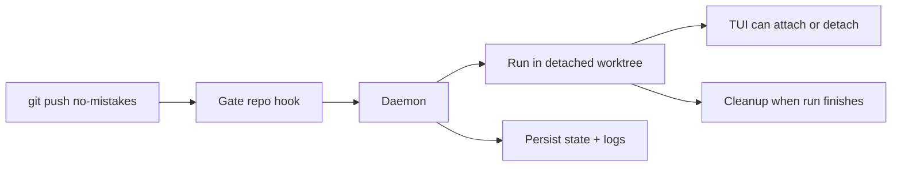

The daemon is a long-running background process that manages pipeline runs. The
installer prefers setting it up as a managed background service, and
`no-mistakes`, `init`, `attach`, `rerun`, and `update` keep that service
installed and running for you when that path is available.

## Why a daemon exists

The daemon exists so `git push no-mistakes` stays fast and the gate can keep
working after your shell command returns.

- Git hands the push to the local gate repo.
- The hook notifies the daemon and exits immediately.
- The daemon owns the long-running work: worktrees, pipeline execution, TUI
  events, state, cleanup, and crash recovery.



On macOS this is a per-user `launchd` agent, on Linux a per-user `systemd` service, and on Windows a Task Scheduler task. The installed artifact names are scoped by `NM_HOME` with a short stable suffix, so the paths and service identifiers look like `~/Library/LaunchAgents/com.kunchenguid.no-mistakes.daemon.<suffix>.plist`, `~/.config/systemd/user/no-mistakes-daemon-<suffix>.service`, and the Windows task `no-mistakes-daemon-<suffix>`. That keeps multiple `no-mistakes` installs from colliding when they use different `NM_HOME` roots. Those service managers keep the daemon available across CLI invocations and restart it after `no-mistakes update` replaces the binary. A managed service starts with a minimal environment, so at daemon startup it resolves `PATH` and proxy variables from your login shell and the baked-in service definition; [Environment the daemon sees](/no-mistakes/reference/environment/#environment-the-daemon-sees) owns that resolution story. Restart the daemon after changing those values. If managed service install or startup is unavailable or fails, `no-mistakes` falls back to starting a detached daemon process instead.

## Starting and stopping

Most people do not need to manage the daemon directly. The usual commands
already make sure it exists when needed.

```sh
# Explicit management
no-mistakes daemon start
no-mistakes daemon stop
no-mistakes daemon restart
no-mistakes daemon status

# Ensures the daemon is running, using the managed service when possible
no-mistakes
no-mistakes init
no-mistakes attach
no-mistakes rerun
no-mistakes axi run
no-mistakes axi respond

# Resets the daemon after replacing the binary
no-mistakes update
```

`no-mistakes update` stops and starts the daemon when it is running, or when stale daemon artifacts exist, so the new executable is used.
It prefers the managed service path and falls back to a detached daemon if service startup is unavailable or fails.
If pending or running pipeline runs exist, `update` refuses to restart the daemon by default and prints each active run's ID, status, branch, and short head SHA. Pass `--force` to restart the daemon anyway and accept that those runs may fail; `-y`/`--yes` does not bypass this guard.
If the daemon is already running from a different executable path, update still prompts before replacing it; `-y`/`--yes` answers that prompt non-interactively.
If the daemon executable path cannot be determined, the update aborts before replacing anything.

`no-mistakes daemon stop` and `no-mistakes daemon restart` apply the same guard: if pending or running pipeline runs exist, each refuses by default and lists the active runs, and each takes its own `--force` to proceed anyway.
Every invocation of `daemon stop`, `daemon restart`, or `update` - forced or not - logs the caller's PID, parent PID, and parent command line to `~/.no-mistakes/logs/cli.log` so a later incident can identify which agent or process triggered it.

The daemon writes an identity record to `~/.no-mistakes/daemon.pid` and listens on a Unix socket at `~/.no-mistakes/socket`. On Windows, it uses a localhost TCP listener and a protected endpoint file at the same path. CLI clients bound how long they wait for that socket to accept a connection with `daemon_connect_timeout` (default `3s`, override with `NM_DAEMON_CONNECT_TIMEOUT`), so a daemon process that is alive but stuck fails the connection instead of hanging the caller; see [Troubleshooting](/no-mistakes/guides/troubleshooting/#check-for-stale-artifacts).
Commands that ensure the daemon is running (`no-mistakes`, `init`, `attach`, `rerun`, `axi run`, `axi respond`) also fail fast rather than silently starting a replacement daemon when the socket file exists but nothing answers at all, such as a dead socket left behind by an unclean exit; `no-mistakes daemon start` self-heals past that case.

Only one live daemon can own an `NM_HOME` at a time.
At startup - before crash recovery runs and before the socket is bound - the daemon takes an exclusive OS file lock on `~/.no-mistakes/daemon.lock` and holds it for the life of the process.
A second daemon started against the same root fails with "a no-mistakes daemon is already running for this NM_HOME" (with the holder's PID and start time when available) instead of stealing the first daemon's socket and running crash recovery against its live runs.
The OS releases the lock automatically when the owning process exits or crashes, even on SIGKILL, so unlike the PID file the lock can never go stale.
As an independent safety layer, the daemon also refuses to bind the Unix socket while something is still answering on it; only a provably stale socket file (nothing listening) is removed and rebound.

## What it does

When a push arrives via the post-receive hook:

1. Creates a detached worktree at `~/.no-mistakes/worktrees/<repoID>/<runID>/`
2. Starts the pipeline executor in that worktree
3. Streams events to any connected TUI clients and serves request/response state to AXI clients
4. Cleans up the worktree when the run finishes (success or failure)

Pipeline agents are prompted to keep intentional writes inside that detached worktree and avoid changing system state outside it, such as Homebrew packages, apps under `/Applications`, or global tool configuration.
That reduces surprising machine-level side effects and macOS App Management prompts, but it is prompt steering rather than a true sandbox.
While executing steps, the daemon also owns child-process cleanup.
Configured commands and one-shot agent subprocesses are terminated as a process tree on completion, failure, or cancellation so leaked test workers, build watchers, or dev servers cannot accumulate across runs.

## Concurrent push handling

If you push to the same branch while a run is already active, the daemon:

1. Cancels the in-progress run (reason: "cancelled: superseded by new push")
2. Waits for it to finish
3. Starts a new run with the latest push

Pushes to different branches run concurrently.

This is another reason the daemon exists: branch-level coordination is easier to
reason about in one long-lived process than inside independent hook invocations.

## Crash recovery

On startup, the daemon checks for runs that were left in `pending` or `running` status (which means the daemon crashed while they were active):

- Resumes only fully recorded parked approval gates whose worktree and step history can be validated; incomplete or ambiguous active runs fail closed
- Before resuming a parked CI gate, re-checks its persisted PR URL through the configured provider; a currently merged or closed PR completes the stale gate, while an open, unknown, or unreachable PR remains parked
- Reconciles an orphaned running CI monitor the same way before failing it: a run with a recorded PR whose other steps are all completed or skipped, whose only running step is CI, and whose worktree still matches the recorded head is re-checked through the provider; a merged or closed PR completes the run and its CI step together in one transaction, while an open, unknown, or unreachable PR fails closed
- Marks every other stale active run as `failed` with the message "daemon crashed during execution"
- Reaps orphaned managed agent servers left behind by a crashed daemon or setup wizard
- Removes orphaned worktree directories via `git worktree remove --force` - but never one whose run is still `pending` or `running`; only leftovers from terminal runs or directories with no matching run record are removed
- Refreshes legacy no-mistakes-managed `post-receive` hooks, installs missing managed hooks, and leaves custom hooks untouched
- Reapplies per-worktree gate hook-path isolation to existing bare repos when Git supports `config --worktree`, so shared `core.hookspath` writes cannot disable `post-receive`
- Enables Git push-option support on existing gate repos so per-push options like `no-mistakes.skip=...` keep working after upgrades
- Clears any parked-awaiting-agent marker so a recovered failed run is not shown as still waiting for `axi respond`

## Logging

Daemon logs go to `~/.no-mistakes/logs/daemon.log`. The setup wizard captures managed agent-server output in `~/.no-mistakes/logs/wizard-agent.log`. Each pipeline step also writes to its own log at `~/.no-mistakes/logs/<runID>/<step>.log`, and fatal step errors are appended there so the step log includes the failure reason even when the detail comes from command stderr. `daemon stop`, `daemon restart`, and `update` invocations are logged separately to `~/.no-mistakes/logs/cli.log` with the caller's PID, parent PID, and parent command line.

Set the log level in global config:

```yaml
log_level: debug # debug | info | warn | error
```

## Shutdown

`no-mistakes daemon stop` stops the current daemon process without removing the managed service. The next `no-mistakes daemon start`, `no-mistakes`, `init`, `attach`, `rerun`, or `update` will start it again through the same service manager when available, or as a detached daemon otherwise.
It refuses by default while pending or running pipeline runs exist for this `NM_HOME`; pass `--force` to stop anyway and accept that those runs may fail.

1. Cancels all active runs
2. Waits up to 30 seconds for goroutines to finish
3. Removes the PID file and socket
